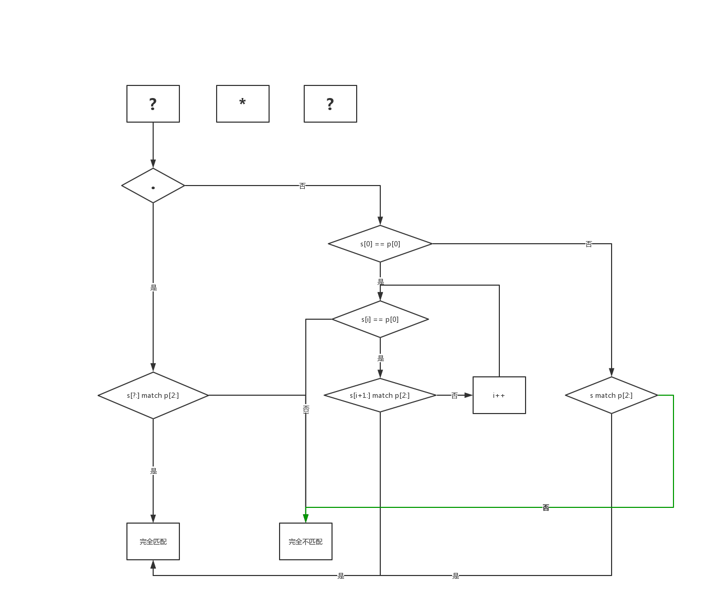

[https://leetcode-cn.com/problems/regular-expression-matching/](https://leetcode-cn.com/problems/regular-expression-matching/)

使用语言：Go

## 解：

```Go
func isMatch(s string, p string) bool {
    if s == p {
        return true
    }
    if len(p) == 0 {
        return len(s) == 0
    }
    if len(p) == 1 || string(p[1]) != "*" {
        // p 有值而 s 无值的情况返回 false
        // p[0] != s[0] 返回 false
        if len(s) == 0 || (string(p[0]) != "." && p[0] != s[0]) {
            return false
        }
        // p 长度为 1,则递归传入的 p 为 "", 需要判断 s 是否为空
        // p 长度大于 1,但是 p[1] != "*"，因此不需要考虑重复匹配的情况，直接进入下一个阶段的匹配
        return isMatch(string(s[1:]), string(p[1:]))
    }


    // p 长度大于 1 并且 p[1] == "*"，需要考虑重复匹配的情况
    // 如果 p[0] == "."，而已知 p[1] == "*"，这是一个万能匹配式，我们只需要知道 p[2:] 是否与 s 中的半段匹配即可。
    // 因此，这里靠 i 做驱动，不断地与 p[2:] 做匹配，只要匹配成功，就全部成功，遍历完 i 依然不成功，就返回不成功
    // 如果 p[0] != "."，而已知 p[1] == "*"，则可以得出 p[0] 对应的字母可以重复任意次。
    // 这里 i 从 -1 开始计算的意义在于 x* 可以匹配 0 次或任意多次。从 -1 开始的意思是假设匹配 0 次，则直接将 s 与 p[2:] 进行匹配。匹配如果不成功，就认为应该选择匹配任意多次的分支，则需要保证 p[0] 与 s[i]相等(可以理解为 s[i-1] 已经与 p[0] 想等了，而 s[i:] 又跟 p[2:] 不匹配，这个时候如果 s[i] 还不跟 p[0] 相等，就可以认为完全不匹配了)
    // 按照递归的思想，我们只处理子问题，剩下的交给递归去解决
    // 这里的子问题是 s[i] 如果跟 p[0] 相等，就继续看 s[i] 后面的元素是否与 p[2:] 匹配即可，一旦后面的元素完全匹配，即可得出 s 和 p 匹配；但是如果不匹配，可能只是因为我们的 s[i:] 还包含了应该跟 p[:2] 匹配的字符，所以继续 i++ 向后检查
    sl := len(s)
    i := -1
    for i < sl && (i < 0 || string(p[0]) == "." || p[0] == s[i]) {
        if isMatch(s[(i+1):], p[2:]) {
            return true
        }
        i++
    }
    return false
}
```

这道题目的难点在于 “*” 的处理上。如果没有 “*” 我们就只需要考虑 s 和 p 的每个字符是否相等，或者 p 中的某个字符是否为 “.”。

为了规避复杂的 “*” 处理，该解法的前半段先处理不带 “*” 的情况。

后半段对 “*” 的处理上，实际上是对各种情况的检测，我画了个示意图：



如上图所示，可以划分出这些情况分支：

1. p 第一个字符是 “.”
  1. s 中有连续的后半段能够匹配 p[2:]，则 s 和 p **完全匹配**
  2. s 中没有连续的后半段能够匹配 p[2:]，则 s 和 p **不匹配**
2. p 第一个字符不是 “.”，而 s[0] == p[0]
  1. s 的所有元素中，前 i 个值都等于 p[0]
    1. 第 i 个元素之后的某后半段字符串能够与 p[2:] 匹配，则 s 和 p **完全匹配**
    2. 没有找到满足条件的后半段字符串，则 s 和 p **不匹配**
  2. s 的所有元素中，s[i:] 与 p[2:] 不匹配，并且，s[i] != p[0]，则 s 和 p **不匹配**。（举个例子：s = "aba", p = "a*a"）
3. p 第一个字符不是 “.”，而 s[0] != p[0]
  1. s 与 p[2:] 匹配，则 s 和 p **完全匹配**
  2. s 与 p[2:] 不匹配，则 s 和 p **不匹配**

根据以上分析，我们发现，实际上在递归的判断匹配的过程中，产生了很多重复路径，为了降低时间复杂度，我们可以引入一个二维数组来缓存已经遍历过的路径结果。

```Go
func isMatch(s string, p string) bool {
    if s == p {
        return true
    }
    if len(p) == 0 {
        return len(s) == 0
    }
    sl := len(s)
    pl := len(p)
    mem := make([][]*bool, sl + 1)
    for i := range mem {
        mem[i] = make([]*bool, pl + 1)
    }
    return _isMatch(s, p, 0, 0, mem)
}


func _isMatch(s, p string, i, j int, mem [][]*bool) bool {
    matched := true
    notMatched := false
    if j >= len(p) {
        return i >= len(s)
    }
    if mem[i][j] != nil {
        return *mem[i][j]
    }
    var subS string
    if i >= len(s) {
        subS = ""
    } else {
        subS = string(s[i:])
    }
    subP := string(p[j:])
    if subS == subP {
        mem[i][j] = &matched
        return true
    }
    if len(subP) == 1 || string(subP[1]) != "*" {
        if len(subS) == 0 || (string(subP[0]) != "." && subP[0] != subS[0]) {
            mem[i][j] = &notMatched
            return false
        }
        r := _isMatch(s, p, i + 1, j + 1, mem)
        mem[i][j] = &r
        return r
    }
    for k:=-1;k<len(subS);k++ {
        if k < 0 || string(subP[0]) == "." || subP[0] == subS[k] {
            if _isMatch(s, p, i + k + 1, j + 2, mem) {
                mem[i][j] = &matched
                return true
            }
        } else {
            mem[i][j] = &notMatched
            return false
        }
    }
    mem[i][j] = &notMatched
    return false
}
```
