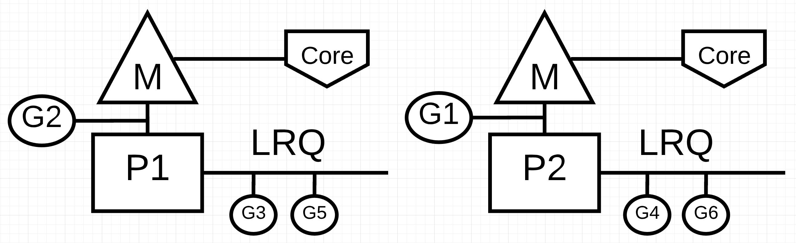

阅读原文：[https://www.ardanlabs.com/blog/2018/12/scheduling-in-go-part3.html](https://www.ardanlabs.com/blog/2018/12/scheduling-in-go-part3.html)

# 引言

当我解决一个问题时，特别是当它是一个新问题时，我并不会一开始就考虑用并发的方式来解决。我会先找到一个线性的解决方案，并确保它能正常工作。然后在经过可读性和技术审查之后，我就会开始问自己这样一个问题：这里是否应该使用并发？有些场景一看就知道适合用并发来处理，有些则不能很清晰的看出来并发是否适用。

在本系列的[第一部分](https://www.ardanlabs.com/blog/2018/08/scheduling-in-go-part1.html)中，我解释了操作系统调度程序的机制和语义，我认为这些机制和语义在你编写多线程代码时，十分重要。[第二部分](https://www.ardanlabs.com/blog/2018/08/scheduling-in-go-part2.html)中，我解释了 Go 调度程序的语义，我认为这些语义对于理解如何在 Go 中编写并发代码很重要。在本篇文章中，我将把操作系统和 Go 调度程序的机制和语义结合在一起，让大家更深入的理解什么是并发，什么不是。

本文的目标是：

- 提供一套思维流程来帮助你考虑是否应该使用并发
- 在不同类型的工作负载状况下语义会发生怎样的变更，从而影响你做出的工程决策

# 什么是并发

并发意味着不按顺序执行。拿一组本该顺序执行的指令集，找到一种能让最终结果跟顺序执行一致的但不需要保证执行顺序的方法。对于眼前的问题，我们必须清楚的认识到，如果能够无序处理将会给我们带来很多的价值。我这里说的价值，是在覆盖无序执行带来的程序复杂性的成本的基础上，带来的性能提升上的价值。当然也要看具体的问题和场景，也许在你的场景中无序执行是不可能的或者根本没有意义的。

同样重要的是，要理解[并发不等同于并行](https://blog.golang.org/waza-talk)。并行意味着同时执行两个或多个指令。这是一个与并发完全不同的概念。至少要有 2 个操作系统和硬件线程，并且至少要有 2 个 Goroutine，每个 Goroutine 都在每个 OS/硬件线程上独立执行指令，并行才有可能发生。



图1 并发与并行

在图1中，您可以看到两个逻辑处理器（P）的图表，每个处理器都有自己的操作系统线程绑定在独立的硬件线程（内核）上。你可以看到两个 Goroutines （G1 和 G2）在**并行**的执行，同时在各自的 OS 或硬件线程上执行各自的指令。在每个逻辑处理器上，3 个 goroutines 轮流享用 OS 线程。在同一个 P 上共享 OS 线程时间的 Goroutines 都是**并发**运行的，指令的执行没有特定顺序。

麻烦的是，有时利用并发而不使用并行性，实际上会降低你的吞吐量。另外，有趣的是，有时把并行和并发结合使用带来的性能提升并没有你想象的大。

# 工作负载

你怎么知道无序执行是有可能的并且是有意义的？从你所处理的问题的工作负载上来分析会是一个不错的开始。有两种类型的工作负载在考虑并发性时十分重要。

- CPU 绑定型：这种工作负载不会涉及到 goroutine 的切换，这种工作的核心在计算上，例如计算 Pi 的第 N 位。
- IO 绑定型：这种工作负载将会让 Goroutines 自然进入等待状态。这种工作通常包括通过网络访问资源、对操作系统进行系统调用、等待某些事件发生等。某个需要读取文件的 Goroutine 就属于 IO 绑定型。我会把同步事件（互斥锁、原子操作）引起的等待也放到这个类别里。

对于 CPU 绑定型的工作负载来讲，并行即是并发，单个操作系统线程或者硬件线程上不应该有额外的并发任务。一个操作系统线程或者硬件线程处理多个 Goroutine 在这个场景下是没有效率可言的，因为 Goroutine 不会因为等待而产生状态切换。如果 Goroutine 的数量超过 OS /硬件线程的数量， Goroutine 切换就会带来额外的成本，从而降低工作负载的执行速度。上下文切换会让你的工作负载进入一个 “Stop The World” 的状态，因为切换期间无法处理任务。

对于 IO 绑定型的工作负载来讲，只需要考虑并发即可。一个单核 CPU 或者单独的硬件线程可以处理多个 Goroutine，因为 Goroutine 会作为其工作负载的一部分自然的来回切换。使用比 OS 或硬件线程更多的 Goroutine 能够加速工作负载的处理，因为切换 Goroutine 带来的开销并不会让整个任务停下来，新切换来的 Goroutine 会开始处理新的任务。你的工作负载会在 IO 等待时自然停止，这使得不同的 Goroutine 可以有效地利用同一操作系统/硬件线程，而不是让操作系统/硬件线程闲置。

怎样才能知道为每个硬件线程绑定多少个 Goroutine 能够达到最佳的吞吐量？Goroutine 太少，就会有更多的空闲时间，Goroutine 太多又会带来过多的上下文切换成本。这是你需要思考的东西，本文不会再做讨论。

现在可以回想一下你设计过的那些代码来巩固一下，区分清楚工作负载何时可以利用并发，何时不能利用并发，以及是否需要并行。

# 加和

我们不需要用太复杂的代码来理解这些语义。看看下面这个 `add` 函数，它对一组整数进行求和计算。

### 代码片段 1

[https://play.golang.org/p/r9LdqUsEzEz](https://play.golang.org/p/r9LdqUsEzEz)

```go
func add(numbers []int) int {
	var v int
	for _, n := range numbers {
		v += n
	}
	return v
}
```

在代码片段 1 中的第 36 行，声明了一个 `add` 函数，该函数接受一个整数集合并返回该集合的和。它从第 37 行开始，声明了一个变量 v 来存和。在第 38 行，函数线性的遍历集合，并将每个数字进行相加求和。最后在第 41 行，将最终结果返回给调用者。

问题：`add` 函数是否适合无序执行？我相信答案是肯定的。可以将整数集合拆分成更小的列表，并且并发的处理这些列表。分别对较小的列表求和后，再将各自的结果相加来得到最后的答案。

然而，另一个问题浮现在我脑海中。为了获得最佳的吞吐量，应该创建并独立处理多少个较小的列表呢？要回答这个问题，你必须知道 `add` 这个函数的工作负载是什么类型。`add` 函数属于 CPU 绑定型的工作负载，因为求和运算是纯数学运算，它不会做出让 Goroutine 进入等待状态的事情。这意味着为了获得良好的吞吐量，每个 OS/硬件线程只服务一个 Goroutine 就够了。

下面的代码片段 2 是我的 `add` 函数的并发版本。

注意：在编写并发版本的 `add` 函数时，有多种方法可以采用。不要纠结于我的具体实现。如果你能想到一个更易读的版本，我希望你能分享出来。

### 代码片段2

[https://play.golang.org/p/r9LdqUsEzEz](https://play.golang.org/p/r9LdqUsEzEz)

```go
func addConcurrent(goroutines int, numbers []int) int {
	var v int64
	totalNumbers := len(numbers)
	lastGoroutine := goroutines - 1
	stride := totalNumbers / goroutines

	var wg sync.WaitGroup
	wg.Add(goroutines)

	for g := 0; g < goroutines; g++ {
		go func(g int) {
			start := g * stride
			end := start + stride
			if g == lastGoroutine {
				end = totalNumbers
			}

			var lv int
			for _, n := range numbers[start:end] {
				lv += n
			}

			atomic.AddInt64(&v, int64(lv))
			wg.Done()
		}(g)
	}

	wg.Wait()

	return int(v)
}
```

在代码片段 2 中，addConcurrent 函数是 add 函数的并发版本。并发版本用了 26 行代码，而非并发版本只用了 5 行代码。这里代码较多，我就着重介绍下比较重要的部分。

第 48 行：计算每个 Goroutine 需要加和计算的数字量。这个 list 的大小是用整个集合的数量除以 Goroutine 的数量算出来的。

第 53 行：创建 Goroutine 池来执行加和工作。

第 57 - 59 行：最后一个 Goroutine 需要注意下列表的边界。

第 66 行：对每个列表的和再次加和得到最终结果

并发版本肯定比顺序版本复杂，但我们不禁要问，这种复杂性有价值吗？回答这个问题最好的方式是创建一个基准测试。我在关闭垃圾收集器的情况下使用了 1000 万个数字的集合来做基准测试。我会对使用 add 函数的顺序版本和使用 addConcurrent 函数的并发版本做比较。

### 代码片段 3：

```go
func BenchmarkSequential(b *testing.B) {
    for i := 0; i < b.N; i++ {
        add(numbers)
    }
}

func BenchmarkConcurrent(b *testing.B) {
    for i := 0; i < b.N; i++ {
        addConcurrent(runtime.NumCPU(), numbers)
    }
}
```

代码片段 3 中可以看到基准测试函数。下面是所有 Goroutine 只能使用一个操作系统/硬件线程的情况。顺序版本使用了 1 个 Goroutine，并发版本使用了 `runtime.NumCPU`，在我的机器上是 8 个 Goroutine。在这种情况下，并发版本利用了并发性而不是并行性。

### 代码片段 4：

```
10 Million Numbers using 8 goroutines with 1 core
2.9 GHz Intel 4 Core i7
Concurrency WITHOUT Parallelism
-----------------------------------------------------------------------------
$ GOGC=off go test -cpu 1 -run none -bench . -benchtime 3s
goos: darwin
goarch: amd64
pkg: github.com/ardanlabs/gotraining/topics/go/testing/benchmarks/cpu-bound
BenchmarkSequential      	    1000	   5720764 ns/op : ~10% Faster
BenchmarkConcurrent      	    1000	   6387344 ns/op
BenchmarkSequentialAgain 	    1000	   5614666 ns/op : ~13% Faster
BenchmarkConcurrentAgain 	    1000	   6482612 ns/op
```

注意：在本地计算机上运行基准测试非常复杂。有太多因素会导致你的测试结果不准确。确保你的机器尽可能处于空闲状态，并且多跑几次。你要确保最后看到的结果是一致的，多运行几次来确认结果的准确性。

代码片段 4 中的基准测试结果显示，当只有一个操作系统/硬件线程可用时，顺序版本比并发版本大约快 10% ~ 13%。这跟我想的一样，因为并发版本在单个操作系统线程上还会有上下文切换的开销和 Goroutine 的管理开销。

下面是每个 Goroutine 都有一个独立的操作系统/硬件线程可用的情况。顺序版本使用 1 个 Goroutine，并发版本使用 `runtime.NumCPU` 个 Goroutine，在我的机器上是 8 个。在这种情况下，并发版本能够利用并行性。

### 代码片段 5：

```
10 Million Numbers using 8 goroutines with 8 cores
2.9 GHz Intel 4 Core i7
Concurrency WITH Parallelism
-----------------------------------------------------------------------------
$ GOGC=off go test -cpu 8 -run none -bench . -benchtime 3s
goos: darwin
goarch: amd64
pkg: github.com/ardanlabs/gotraining/topics/go/testing/benchmarks/cpu-bound
BenchmarkSequential-8        	    1000	   5910799 ns/op
BenchmarkConcurrent-8        	    2000	   3362643 ns/op : ~43% Faster
BenchmarkSequentialAgain-8   	    1000	   5933444 ns/op
BenchmarkConcurrentAgain-8   	    2000	   3477253 ns/op : ~41% Faster
```

代码片段 5 中的基准测试结果显示，当每个 Goroutine 都有一个单独的操作系统/硬件线程时，并发版本比顺序版本快大约 41% ~ 43%。这跟我想的一样，因为所有 Goroutine 都是并行运行，8 个 Goroutine 在同一时间执行并发工作。

# 分类

并不是所有 CPU 绑定型的工作负载都适用于并发性，理解这一点很重要。

需要了解的是，并非所有的CPU绑定型的工作负载都适用于并发。因为在做工作分解，并将所有的结果合并起来时，成本非常高。冒泡排序就是一个很典型的例子。下面的代码在 Go 中实现了冒泡排序。

### 代码片段 6：

[https://play.golang.org/p/S0Us1wYBqG6](https://play.golang.org/p/S0Us1wYBqG6)

```go
package main

import "fmt"

func bubbleSort(numbers []int) {
	n := len(numbers)
	for i := 0; i < n; i++ {
		if !sweep(numbers, i) {
			return
		}
	}
}

func sweep(numbers []int, currentPass int) bool {
	var idx int
	idxNext := idx + 1
	n := len(numbers)
	var swap bool

	for idxNext < (n - currentPass) {
		a := numbers[idx]
		b := numbers[idxNext]
		if a > b {
			numbers[idx] = b
			numbers[idxNext] = a
			swap = true
		}
		idx++
		idxNext = idx + 1
	}
	return swap
}

func main() {
	org := []int{1, 3, 2, 4, 8, 6, 7, 2, 3, 0}
	fmt.Println(org)

	bubbleSort(org)
	fmt.Println(org)
}
```

在代码片段 6 中，用 Go 实现了一个冒泡排序示例。这种排序算法在每次遍历时，都会扫一遍整数的集合，并将其值交换。根据列表的顺序，在将整个集合变的有序之前，可能需要对这个集合进行多次遍历。

问题：`bubbleSort` 函数是否适合无序执行？我认为不太适合。整数的集合可以被分解成多个更小的列表，这些列表可以并发排序。然而，在所有并发工作完成之后，依然需要将这些列表排序合并成一个列表。下面是一个冒泡排序的并发版本示例。

### 代码片段 7：

```go
func bubbleSortConcurrent(goroutines int, numbers []int) {
    totalNumbers := len(numbers)
    lastGoroutine := goroutines - 1
    stride := totalNumbers / goroutines

    var wg sync.WaitGroup
    wg.Add(goroutines)

    for g := 0; g < goroutines; g++ {
        go func(g int) {
            start := g * stride
            end := start + stride
            if g == lastGoroutine {
                end = totalNumbers
            }

            bubbleSort(numbers[start:end])
            wg.Done()
        }(g)
    }

    wg.Wait()

    // Ugh, we have to sort the entire list again.
    bubbleSort(numbers)
}
```

在代码片段 7 中，`bubbleSortConcurrent` 函数是 `bubbleSort` 的并发版本。它使用多个 Goroutine 对分割好的列表并发排序。然而，这样最后得到的只是一堆排好序的列表。给定一个 36 个数字的列表，分成 12 组，每组排序完成之后，还需要合并到一起整体做一次排序。

### 代码片段 8：

```
Before:
  25 51 15 57 87 10 10 85 90 32 98 53
  91 82 84 97 67 37 71 94 26  2 81 79
  66 70 93 86 19 81 52 75 85 10 87 49

After:
  10 10 15 25 32 51 53 57 85 87 90 98
   2 26 37 67 71 79 81 82 84 91 94 97
  10 19 49 52 66 70 75 81 85 86 87 93
```

冒泡排序的本质是遍历列表，因此最后一次整体的冒泡排序将抵消使用并发性带来的全部收益。对于冒泡排序，使用并发性不会提高性能。

# 阅读文件

我们刚刚讨论了两个 CPU 绑定型的例子，那么 IO 绑定型的工作负载又如何呢？当 Goroutine 自然地进出等待状态时，情况是否会有所不同呢？我们看一个 IO 绑定型的例子 —— 读取文件并进行文本搜索。

第一个版本是一个叫做 `find` 的函数的顺序版本。

### 代码片段 9：

[https://play.golang.org/p/8gFe5F8zweN](https://play.golang.org/p/8gFe5F8zweN)

```go
func find(topic string, docs []string) int {
	var found int
	for _, doc := range docs {
		items, err := read(doc)
		if err != nil {
			continue
		}
		for _, item := range items {
			if strings.Contains(item.Description, topic) {
				found++
			}
		}
	}
	return found
}
```

在代码片段 9 中，可以看到 `find` 函数的顺序版本。在第 43 行，声明了一个名为 `found` 的变量来记录文档列表中出现指定主题的次数。然后在第 44 行，对文档列表进行遍历并在第 45 行使用 `read` 函数读取文档内容。最后，在第 49 ~ 53 行，使用 `strings` 包中的 `Contains` 函数来检查主题是否包含指定的主题字符串。如果找到主题，则将 `found` 加 1。

下面是 `find` 函数中调用的 `read` 函数的实现。

### 代码片段 10：

[https://play.golang.org/p/8gFe5F8zweN](https://play.golang.org/p/8gFe5F8zweN)

```go
func read(doc string) ([]item, error) {
	time.Sleep(time.Millisecond) // Simulate blocking disk read.
	var d document
	if err := xml.Unmarshal([]byte(file), &d); err != nil {
		return nil, err
	}
	return d.Channel.Items, nil
}
```

代码片段 10 中，`read` 函数最开始使用 `time.Sleep` 产生 1ms 的延迟。这个调用是用来模拟系统调用从磁盘读取文件时产生的延迟。这个延迟的一致性对于准确衡量 `find` 函数的顺序版与并发版的性能是非常重要的。然后在第 35-39 行，将存储在全局变量 `file` 中的用来模拟的 xml 文档解构成一个 struct 值进行处理。最后，在第 39 行返回从 xml 中读取到的 Items 集合。

有了顺序版之后，我们来看看并发版。

注意：在编写 find 函数的并发版本时，有几种方法可供选择。先不用纠结于我的具体实现。如果您有一个更易读的版本，有相同的执行过程或者比我的更好，希望你能分享出来。

### 代码片段 11：

[https://play.golang.org/p/8gFe5F8zweN](https://play.golang.org/p/8gFe5F8zweN)

```go
func findConcurrent(goroutines int, topic string, docs []string) int {
	var found int64

	ch := make(chan string, len(docs))
	for _, doc := range docs {
		ch <- doc
	}
	close(ch)

	var wg sync.WaitGroup
	wg.Add(goroutines)

	for g := 0; g < goroutines; g++ {
		go func() {
			var lFound int64
			for doc := range ch {
				items, err := read(doc)
				if err != nil {
					continue
				}
				for _, item := range items {
					if strings.Contains(item.Description, topic) {
						lFound++
					}
				}
			}
			atomic.AddInt64(&found, lFound)
			wg.Done()
		}()
	}

	wg.Wait()

	return int(found)
}
```

在代码片段 11 中，`findConcurrent` 函数是 `find` 函数的并发版本。并发版本使用了 30 行代码，而非并发版本仅使用了 13 行代码。我实现并发版本的目的是使用有限的 Goroutine 处理未知数量的文档。我选择了一种池模式，即使用一个 channel 来供这些 Goroutine 来消费。

这里代码比较多，我重点介绍下我认为比较重要的行。

第 61-64 行：创建一个 channel 并将需要处理的文档填充到 channel 中。

第 65 行：将 channel 关闭，这样当 channel 中的数据都消耗掉后，Goroutine 就自然停止了。

第 70 行：创建 Goroutine 池。

第 73-83 行：池中的每个 Goroutine 都从 channel 中接收文档，将文档读入内存并搜索主题。当有匹配项时，lFound 变量将递增。

第 84 行：将每个 Goroutine 得到的 lFound 进行加和，得到最终计数。

并发版本会比顺序版本更复杂，但是这种复杂性值得引入吗？再次回答这个问题的最好办法依然是创建一个基准测试。我会在关闭垃圾收集器的情况下使用 1000 个文档进行基准测试。分别用 `find` 函数的顺序版本和使用 `findConcurrent` 函数的并发版本进行基准测试。

### 代码片段 12：

```go
func BenchmarkSequential(b *testing.B) {
    for i := 0; i < b.N; i++ {
        find("test", docs)
    }
}

func BenchmarkConcurrent(b *testing.B) {
    for i := 0; i < b.N; i++ {
        findConcurrent(runtime.NumCPU(), "test", docs)
    }
}
```

代码片段 12 中展示了基准测试函数。下面是所有 Goroutine 只有一个操作系统/硬件线程可用的情况。顺序版本只使用 1 个 Goroutine，并发版本使用 `runtime.NumCPU` 个 Goroutine，在我本机是 8 个。在这种情况下，并发版本无法利用并行性。

### 代码片段 13：

```
10 Thousand Documents using 8 goroutines with 1 core
2.9 GHz Intel 4 Core i7
Concurrency WITHOUT Parallelism
-----------------------------------------------------------------------------
$ GOGC=off go test -cpu 1 -run none -bench . -benchtime 3s
goos: darwin
goarch: amd64
pkg: github.com/ardanlabs/gotraining/topics/go/testing/benchmarks/io-bound
BenchmarkSequential      	       3	1483458120 ns/op
BenchmarkConcurrent      	      20	 188941855 ns/op : ~87% Faster
BenchmarkSequentialAgain 	       2	1502682536 ns/op
BenchmarkConcurrentAgain 	      20	 184037843 ns/op : ~88% Faster
```

代码清单 13 中展示了只有一个操作系统/硬件线程可用于 Goroutine 时，并发版本比顺序版本大约快 87%~88%。这正是我所期望的，因为所有的 Goroutine 都有效地共享单个操作系统/硬件线程。`read` 调用中每个 Goroutine 自然地发生上下文切换，让单个 OS/硬件线程得以在单位时间内完成更多的工作。

下面是使用了并行性的基准测试。

### 代码片段 14：

```
10 Thousand Documents using 8 goroutines with 1 core
2.9 GHz Intel 4 Core i7
Concurrency WITH Parallelism
-----------------------------------------------------------------------------
$ GOGC=off go test -run none -bench . -benchtime 3s
goos: darwin
goarch: amd64
pkg: github.com/ardanlabs/gotraining/topics/go/testing/benchmarks/io-bound
BenchmarkSequential-8        	       3	1490947198 ns/op
BenchmarkConcurrent-8        	      20	 187382200 ns/op : ~88% Faster
BenchmarkSequentialAgain-8   	       3	1416126029 ns/op
BenchmarkConcurrentAgain-8   	      20	 185965460 ns/op : ~87% Faster
```

清单 14 中的基准测试结果表明，引入额外的操作系统/硬件线程并不能提供更好的性能。

# 总结

本文的目的是提供一些语义方面的指导，你必须在确定工作负载是否适合使用并发前考虑这些语义。我试图提供不同类型的算法和工作负载的示例，以便你能看到语义上的差异以及需要作出的不同工程决策。

你可以清楚的看到，对于 IO 绑定型的工作负载，并行并不能大幅的提高性能。而 CPU 绑定型的工作负载恰恰相反。当涉及到像冒泡排序这样的算法时，并发的使用会增加复杂性，并且不会带来任何实际的好处。重要的是确定你的工作负载是否适合并发，同时确定你的工作负载属于哪种类型。
