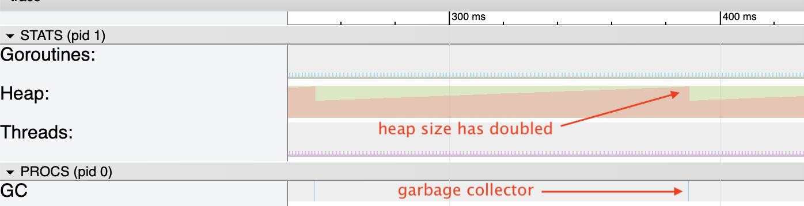
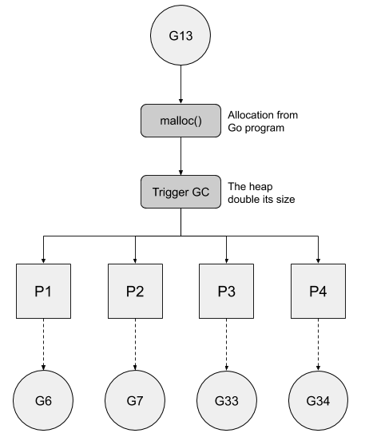
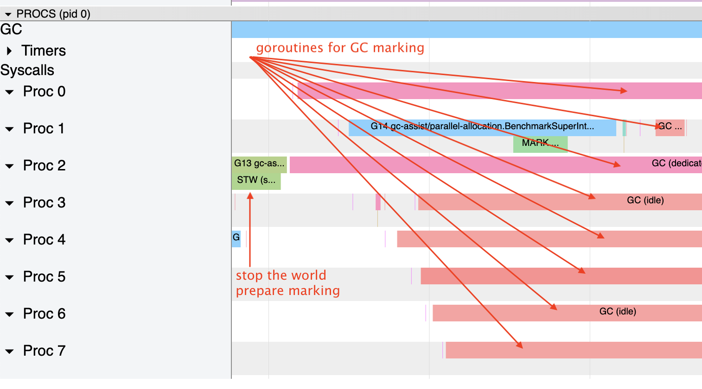
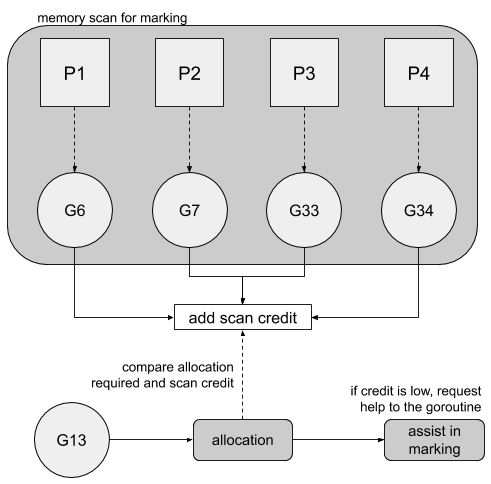
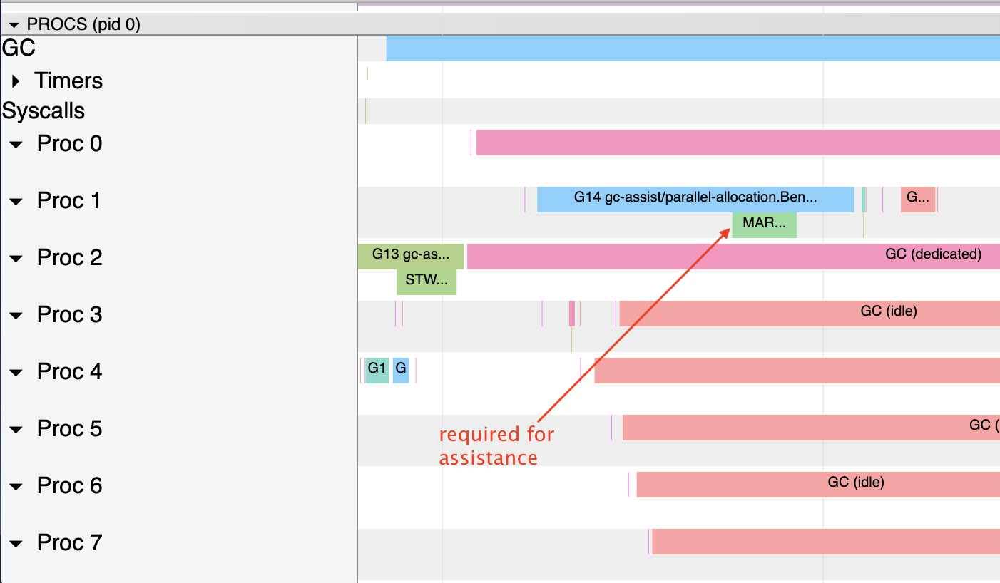
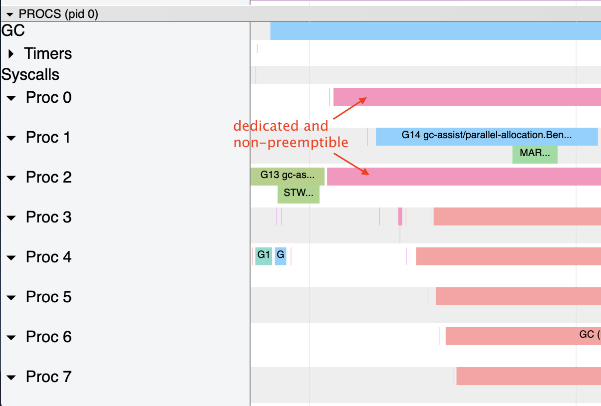
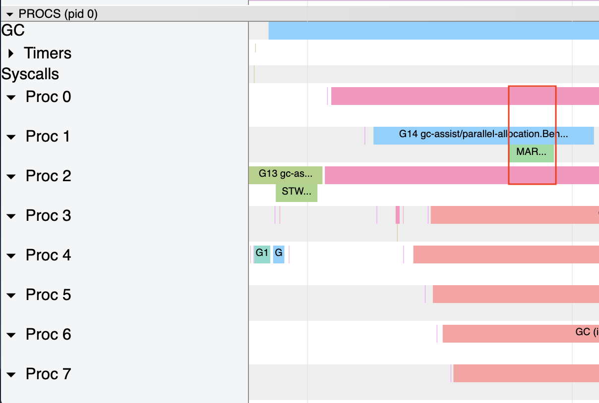

原文链接：[https://medium.com/a-journey-with-go/go-how-does-the-garbage-collector-watch-your-application-dbef99be2c35](https://medium.com/a-journey-with-go/go-how-does-the-garbage-collector-watch-your-application-dbef99be2c35)

本文基于 Go 1.13

Go 的垃圾回收器帮助我们自动回收不再需要的内存。然而，不停的跟踪内存的使用情况并进行清理可能会影响程序的性能。Go 的垃圾回收期就是为了[解决这些问题](https://blog.golang.org/ismmkeynote)，并专注于以下目标：

* 尽可能的减少标记和清除两个阶段，因为标记和清除会让整个程序停下来，也称为“stop the world”
* 一轮垃圾回收消耗的时间降低到 10ms 以下
* 垃圾回收周期占用的 CPU 时间不超过 25%

这几个目标并不容易达到，但是如果垃圾回收器能从我们的程序中学到足够多的东西，它也许能够达到这些目标。

## 达到堆内存的阈值
垃圾回收器关注的第一个指标就是堆内存的增长。默认情况下，当堆内存大小增长翻倍时，就会触发垃圾回收器运行。下面这个简单的程序中将在循环中不断申请堆内存：

```Go
func BenchmarkAllocationEveryMs(b *testing.B) {
		// need permanent allocation to clear see when the heap double its size
		var s *[]int
		tmp := make([]int, 1100000, 1100000)
		s = &tmp
	

		var a *[]int
		for i := 0; i < b.N; i++  {
			tmp := make([]int, 10000, 10000)
			a = &tmp
	

			time.Sleep(time.Millisecond)
		}
		_ = a
		runtime.KeepAlive(s)
	}
```
我们能够从 trace 工具上看到垃圾回收器被触发的时机：



只要堆内存的大小翻倍，内存分配器就会触发垃圾回收程序。可以通过 GODEBUG=gctrace=1 来将相关信息打印出来：

```
gc 8 @0.251s 0%: 0.004+0.11+0.003 ms clock, 0.036+0/0.10/0.15+0.028 ms cpu, 16->16->8 MB, 17 MB goal, 8 P
gc 9 @0.389s 0%: 0.005+0.11+0.007 ms clock, 0.041+0/0.090/0.11+0.062 ms cpu, 16->16->8 MB, 17 MB goal, 8 P
gc 10 @0.526s 0%: 0.046+0.24+0.014 ms clock, 0.37+0/0.14/0.23+0.11 ms cpu, 16->16->8 MB, 17 MB goal, 8 P
```
gc 9 对应的是我们图中看到的那个周期，运行时间是 389ms。16->16->8 MB 表示在 gc 之前使用了多少内存，gc 之后还有多少内存在使用中。我们可以看到，在第 8 个周期 gc 之后还剩余 8MB，当第 9 个周期内存用量涨到 16MB 后，gc 被触发。

这个阈值是通过环境变量 **GOGC** 来控制的。这个环境变量默认值为 100，意味着垃圾回收器会在堆内存增长 100% 时启动。为了提高性能，并且减少 gc 的次数，只有在堆内存大于 4MB * GOGC 时才会按照这个策略启动垃圾回收器。即当 GOGC 设置为 100 时，堆内存在小于 4MB 时，即使增长达到 100% 也不会触发 gc。

## 达到时间阈值

垃圾回收器关注的第二个指标就是两次 gc 之间的时间差。如果自上次 gc 后两分钟仍然没有触发过 gc，就会强制发起一次 gc。

从 GODEBUG 的 trace 上我们可以看到，一次 gc 会在两分钟后强制启动：

```
GC forced
gc 15 @121.340s 0%: 0.058+1.2+0.015 ms clock, 0.46+0/2.0/4.1+0.12 ms cpu, 1->1->1 MB, 4 MB goal, 8 P
```

## 需要协助

垃圾回收主要由两个阶段组成：

* 标记仍在使用的内存
* 清除未被标记为使用中的内存空间

在标记阶段，Go 必须保证标记的速度比新分配的速度更快。实际上，如果收集器标记了 4MB 的内存空间，而同时系统又分配了 4MB 的内存空间，那么紧接着下一轮 gc 也跟着来了。

为了解决这个问题，Go 在标记内存的同时跟踪新内存空间的分配情况，并监控垃圾回收器何时负债。第一步是为每个处理器准备一个处于空闲状态的 goroutine，等待标记阶段开始。这件事是在触发垃圾回收器时进行处理的第一件事。




使用 trace 工具，可以看到这些 goroutines：



一旦这些 goroutine 产生，垃圾回收器就开始标记阶段，该阶段将会检查应该标记和清除哪些变量。被标记为 GC dedicated （GC 专用）的 goroutine ，最为专注，除非被抢占，否则会一直进行标记工作，而被标记为 GC idle 的 goroutine，则最为懒惰，做一点标记工作就进入空闲状态。这些 goroutine 都可以被抢占。

现在垃圾回收器做好准备开始标记所有未被使用的变量了。对于每个被扫描到的变量，会通过计数的方式，来跟踪当前工作，并得到剩余未进行工作的情况。当在垃圾回收阶段有其他 goroutine 在执行时，Go 将会对所需分配的内存和已经完成扫描的内存进行对比，以便比较扫描速度和分配内存请求。如果比较结果更偏向扫描，当前的 goroutine 就不需要任何帮助。而如果扫描的不如申请的多，Go 将会使用更多的 goroutine 来提供帮助。下图反映了这个逻辑：




在我们的示例中，由于 G13 申请了更多的内存，超过了扫描的量，因此 G14 也加入到了标记的工作中来：



## CPU 限制

Go 垃圾回收器要达到的目标之一是占用不超过 25% 的 CPU。这意味着，在标记阶段，Go 不应该分配超过四分之一的处理器。实际上，这正是我们在前面的示例中看到的，只有两个goroutines 完全专用于垃圾收集（有 8 个处理器）：



正如我们所看到的，其他 goroutine 只有在它们无事可做的时候才来进行标记工作。然而，当垃圾回收器需要其他 goroutine 来帮助标记时，Go 程序可能会有超过 25% CPU 时间来用于垃圾回收，看看 G14 就知道了：



在这个例子中，在红框这个很短的时间内，有八分之三的 CPU 时间被分配给垃圾回收。这种情况比较少见，而且只会发生在高内存分配的情况下。


