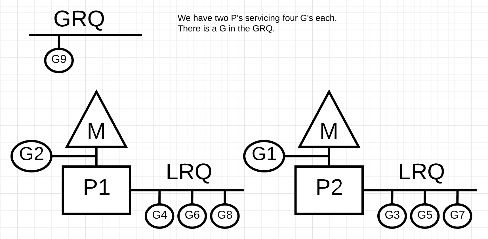
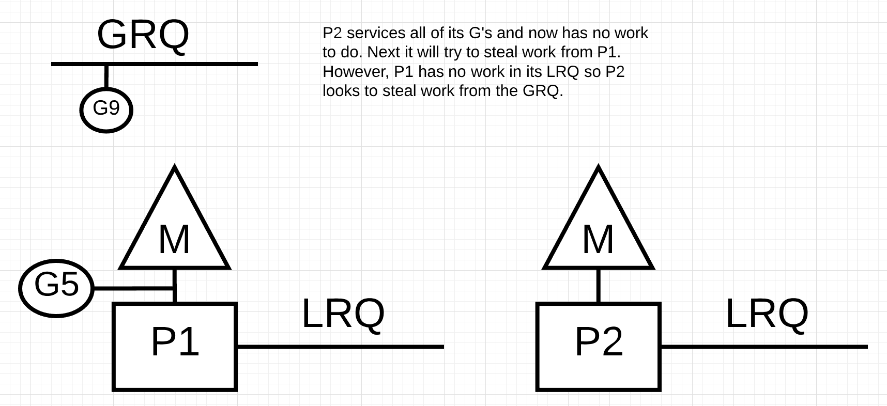

原文地址：[https://www.ardanlabs.com/blog/2018/08/scheduling-in-go-part2.html](https://www.ardanlabs.com/blog/2018/08/scheduling-in-go-part2.html)

# 简介

在本系列的[第一部分](https://www.ardanlabs.com/blog/2018/08/scheduling-in-go-part1.html)中，我重点介绍了操作系统调度程序中我认为很重要并且对理解 Go 调度程序设计有重要意义的几个点。在本篇文章中，我将从语义层面解释 Go 调度程序是如何工作的，并重点关注高层级的行为。Go 调度器是一个非常复杂的系统，一些小的底层细节并不重要。更重要的是要形成一个好的模型来说明事物是如何工作和运转的。有了这个模型，你就能做出更好的的工程决策。

# 你的程序开始了

当你的 Go 程序启动时，它会为主机上标识的每个虚拟内核创建一个逻辑处理器（P）。如果你的处理器的每个物理核芯有多个硬件线程（[超线程](https://zh.wikipedia.org/wiki/%E8%B6%85%E5%9F%B7%E8%A1%8C%E7%B7%92)），每个超线程会作为虚拟核芯呈现给你的 Go 程序。为了更好的理解这一点，我们看下基于我的 MacBook Pro 产生的系统报告。

你可以看到我有一个 4 核的单处理器。这个报告中没有描述每个物理核芯的超线程数量。英特尔酷睿 i7 处理器一般有每个物理核芯有两个超线程，共有 8 个超线程。Go 会认为有 8 个虚拟内核可以并行执行 OS 线程。

为了验证这一点，可以看下下面这段程序：

    package main
    
    import (
    	"fmt"
    	"runtime"
    )
    
    func main() {
    
        // NumCPU returns the number of logical
        // CPUs usable by the current process.
        fmt.Println(runtime.NumCPU())
    }

当我在本地运行这段程序时，NumCPU() 函数的调用结果是 8。也就是说，我在这台机器上运行的任何 Go 程序都会产生 8 个 p。

每个 p 都会被分配一个 OS 线程（“M”）。M 表示机器。这个线程依然由操作系统进行管理，按照[上一篇](https://www.ardanlabs.com/blog/2018/08/scheduling-in-go-part1.html)的解释，操作系统会负责调度这个线程到某个核芯上。这意味着当我在这台机器上运行 Go 程序时，可以有 8 个线程来执行我的程序，每个线程单独的与某个 P 绑定。

每个 Go 程序都会有一个初始的 Goroutine（“G”），它是执行 Go 程序的入口。一个 Goroutine 本质上是一个 [Coroutine](https://zh.wikipedia.org/wiki/%E5%8D%8F%E7%A8%8B)，在 Go 里，我们直接把 C 替换成 G，于是就有了 Goroutine。你可以把 goroutine 理解成一个应用级的线程，它在很多地方都与 OS 线程相似。操作系统线程是在内核上做上下文切换，goroutine 是在 M 上做上下文切换。

最后一个难题是运行队列。在 Go 调度程序中有两个不同的运行队列：全局运行队列（GRQ - Global Run Queue）和本地运行队列（LRQ - Local Run Queue）。每个 P 都有一个 LRQ，用来管理分配到这个 P 上下文中的 Goroutine。这些 Goroutine 通过上下文切换，轮流分配给与这个 P 绑定的 M。GRQ 会用来放置那些尚未被指定 P 的 Goroutine。我们稍后会讨论一个 Goroutine 从 GRQ 移动到 LRQ 的具体过程。

下图提供了这些组件的关系：

# 协作调度器

正如我们在第一篇文章中所讨论的，OS 调度器是一种抢占式调度器。从本质上讲，这意味着你无法预测在任意给定时间内调度器会做什么。真正做决定的是内核，所有的事情都是不确定的。在操作系统之上运行的应用程序无法控制内核中发生的事情，除非它利用诸如 [atomic](https://zh.wikipedia.org/wiki/%E7%BA%BF%E6%80%A7%E4%B8%80%E8%87%B4%E6%80%A7) 指令和 [mutex](https://zh.wikipedia.org/wiki/%E4%BA%92%E6%96%A5%E9%94%81) 调用之类的同步原语。

Go 调度器是 Go 运行时的一部分，而 Go 运行时已经内置于你的应用程序中了。这意味着 Go 调度器是在内核之上的[用户空间](https://zh.wikipedia.org/wiki/%E4%BD%BF%E7%94%A8%E8%80%85%E7%A9%BA%E9%96%93)中运行的。Go 调度器目前的实现是一个协作式调度器，而不是抢占式调度器。作为一个协作式调度器，需要定义明确的用户空间事件来做调度决策，这些用户空间事件应该在代码中的安全点上发起。

Go 协作式调度器的巧妙之处在于他感觉上是抢占式的。你不能预测 Go 调度器将要做什么。这是因为整个协作计划的决策并不掌握在开发人员手中，而是掌握在 Go 运行时中。应当把 Go 调度程序当做是抢占式的，并且要注意调度是不确定的。

# Goroutine 状态

就像线程一样，Goroutine 也有三种高级状态。这些决定了 Go 调度程序面对不同 Goroutine 时扮演的角色。一个 Goroutine 可以处于这三种状态之一：等待、就绪、执行中。

**等待：**这意味着 Goroutine 停下来了，并且在等待某些资源以让工作继续下去。这可能是由于等待操作系统（系统调用）或同步调用（原子操作和互斥锁等）。这些类型的[延迟](https://zh.wikipedia.org/wiki/%E5%BB%B6%E8%BF%9F_(%E5%B7%A5%E7%A8%8B%E5%AD%A6))是导致早高性能的根本原因。

**就绪：**这意味着 Goroutine 需要 M 上的时间来执行指定的命令。如果你有很多 Goroutine 需要时间，那这些 Goroutine 就必须等待更长的时间才能得到时间。而且随着 Goroutine 之间不断的争抢时间，每个 Goroutine 分到的时间会都会缩短。这种类型的调度延迟也会导致性能变差。

**运行中：**这意味着 Goroutine 已经被绑定到 M 上并开始执行其指令。与应用程序相关的工作逐步完成。这是我们想要的情况。

# 上下文切换

Go 调度器需要定义明确的用户空间事件来做调度决策，这些用户空间事件应该从代码中的上下文切换的安全点上发起。这些时间和安全点体现在函数调用中。函数调用对于 Go 调度程序的运行状态至关重要。在 Go 1.11 或更早的版本中，如果你运行任何不进行任何函数调用的循环体，将导致调度程序和垃圾回收的延迟。在适当的时间范围内进行函数调用是十分重要的。

注意：1.12 中有个已经通过的提案 —— 在 Go 调度器中应用非合作式抢占技术以允许抢占紧密循环的程序体。

在 Go 程序中发生的四类事件将会成为调度器做出调度决策的依据。这并不意味着在这四类事件发生时总要发生调度，只是表示调度器有机会可以进行调度了。

- go 关键字的使用
- gc
- 系统调用
- 同步与编排

### go 关键字的使用

go 关键字将会创建 Goroutine。一旦新的 Goroutine 被创建，调度程序就获得了一次调度决策的机会。

### GC

GC 会使用多个 Goroutines 执行，这些 Goroutines 都需要在 M 上运行的时间，因此 GC 会产生大量的调度混乱。幸运的是，调度器知道每个 Goroutine 正在做什么，基于这些信息就能做出明智的决定。它会将使用到堆的 Goroutine 与没有使用堆的 Goroutine 进行上下文切换。当 GC 发生时，会产生大量的调度决策。

### 系统调用

如果一个 Goroutine 进行了系统调用，会导致这个 Goroutine 阻塞在 M 上。有时调度器会进行上下文切换，将一个新的 Goroutine 调度到这个 M 上，而把这个阻塞的 Goroutine 从 M 上撤下来。有时也会需要新的 M 来执行 P 中排队的 Goroutines。下一节会详细讲解这部分是怎么工作的。

### 同步和编排

如果是原子操作、互斥锁或者 channel 操作导致的 Goroutine 进入阻塞状态，调度程序也可能会进行上下文切换调度一个新的 Goroutine 来运行。一旦被阻塞的 Goroutine 可以再次运行，他就会重新排到队里，最终通过上下文切换回到 M 上。

# 异步系统调用

当你使用的操作系统具有异步处理系统调用的能力时，可以使用 [network poller](https://golang.org/src/runtime/netpoll.go) 一类的东西来更有效的处理系统调用。这是通过在操作系统中使用 kqueue(MacOS)、epoll(Linux)、iocp(Windows) 来实现的。

基于网络的系统调用可以被我们今天使用的大多数操作系统异步处理。这就是网络轮询器这个名字的来由，因为它的主要工作时处理网络操作。通过使用网络轮询器来进行网络系统调用可以防止 Goroutine 在进行系统调用时阻塞 M。这样做能有效地保证 M 的利用率，它会一直执行 P 的 LRQ 中的其他 Goroutines，而无需创建新的 M，从而减少操作系统上的调度负载。

了解事物工作原理的最佳方法是运行一个实例。

上图是一个基础调度图。G1 正在占用 M 执行指令，还有三个甚至更多个 Goroutines 在 LRQ 中等待 M。网络轮询器则无所事事。

在上图中，G1 希望进行网络系统调用，因此 G1  被移动到网络轮询器中，并开始异步处理网络系统调用。一旦 G1 移动到网络轮询器中，M 就可以被 LRQ 中的 Goroutine 使用了。此时，G2 通过上下文切换到了 M 上。

上图中，网络轮询器完成了异步网络系统调用，G1 被重新移回到 P 的 LRQ 中。一旦 G1 可以通过上下文切换回到 M，它负责的相关 Go 代码就能够被再次执行。这里最大的优势是，执行网络系统调用时不需要额外的 M。网络轮询器有一个独立的操作系统线程，它正在高效的处理事件循环。

# 同步系统调用

当 Goroutine 执行不可以异步完成的系统调用时，会发生什么？这种情况下，无法使用网络轮询器并且 Goroutine 进行系统调用将阻塞 M。这种情况我们不希望发生，但又无可避免。基于文件系统的调用就是一个不能异步进行系统调用的例子。如果你正在用 CGO，可能还会遇到别的情况比如调用 C 函数，也会阻塞 M。

注意：Windows 操作系统具有异步调用文件系统的能力。从技术上讲，在 Windows 上运行时，也可以使用网络轮询器。

让我们来看看那些导致 M 被阻塞的同步系统调用（比如文件 I/O）被触发时，会发生哪些事情。

上图再次展示了目前的基本调度情况，但是这次 G1 将会进行一次同步系统调用来阻塞 M1。

上图中，调度程序能够识别出 G1 导致 M1 阻塞的情况。此时，调度程序将 M1 从 P 上分离出来，但是仍然会保持 G1 和 M1 的绑定状态。接着调度程序引入了一个新的 M2 来为 P 服务。此时 G2 被调度器从 LRQ 中通过上下文切换调度到 M2 上。如果此前做过 M 的交换操作，并且有空闲的 M，那这个转换过程会比重新创建一个新的 M 快很多。

上图表示G1 的同步系统调用执行完成了。此时 G1 被移回到 P 的 LRQ 中。M1 则留作备用，来应对下次发生这种情况。

# Work Stealing

调度程序还拥有另一面 —— 窃取别人的工作。这是为了保证某些情况的调度效率。我们最不希望看到的就是 M 进入等待状态，因为一旦这种情况发生，操作系统将在内核上进行上下文切换来把 M 换掉。这意味着 P 什么都做不了，即使已经有准备好的 Goroutine，这种情况会一直持续到 M 通过上下文切换会到内核上运行。偷窃工作有助于平衡所有 P 的 Goroutines，所有工作将会得到更合理的分布，最终被高效的执行完成。

让我们来看一个例子。

在上图中，我们有一个多线程 Go 程序，其中有个两个 P，每个 P 有 4 个 Goroutines，并且在 GRQ 中还有一个单独的 Goroutine。如果其中一个 P 迅速完成了分配给他的全部 Goroutines，之后会发生什么呢？

上图中，P1 已经没有要执行的 Goroutine 了，但 P2 的 LRQ 和 GRQ 中还有很多已经准备好待运行的 Goroutine，此时 P1 会开始偷窃工作。[偷窃工作](https://golang.org/src/runtime/proc.go)的规则如下：

    runtime.schedule() {
        // only 1/61 of the time, check the global runnable queue for a G.
        // if not found, check the local queue.
        // if not found,
        //     try to steal from other Ps.
        //     if not, check the global runnable queue.
        //     if not found, poll network.
    }

根据上述代码中的这些规则，P1 会从 P2 的 LRQ 中检查 Goroutines 的数量，并从中偷走一半。

上图中，P1 从 P2 拿走了一半的 Goroutine，现在 P1 可以执行执行 Goroutines 了。

如果 P2 完成了全部的 Goroutines，而 P1 的 LRQ 中也什么都没有了，会发生什么事情呢？

上图中，P2 完成了所有工作，现在要去偷一些别人的。首先它查看了 P1 的 LRQ，一无所获，接着他开始关注 GRQ，并从中找到了 G9。

在上图中，P2 从 GRQ 中偷走了 G9 并拿去执行。偷窃工作的伟大之处在于他能让所有的 M 持续忙碌，而不是无所事事。这种工作偷窃被内部认为是轮转 M。JBD 在她的博客中很好的解释了[偷窃工作](https://rakyll.org/scheduler/)这种方式带来的其他好处。

# 实例

机制和语义基本都讲解到了，接下来我会向你展示如何通过将这些组合在一起来让 Go 调度程序执行更多的工作。设想一个用 C 编写的多线程应用程序，该程序管理着两个系统线程并且这两个线程之间相互传递消息。

在上图中，两个线程之间来回传递消息。线程 1 通过上下文切换得到了在 C1 上执行的机会，线程 1 此时的主要任务是发送消息给线程 2。

注意：消息如何传递并不重要，重要的是编排过程中线程的状态。

上图中，线程 1 发送完消息后会等待对方的响应。这会导致线程1从 C1 上被切换下来进入等待状态。线程2 收到这条消息后，会进入就绪状态。操作系统会对线程2 进行上下文切换，好让他得到在 C2 上的执行机会。接着，线程2 处理完消息发送了一条新的消息给线程 1。

在上图中，线程 1 收到线程 2 发来的消息后，再次发生了上下文切换。线程 2 从可执行状态切换到了等待状态，而线程 1 从就绪状态切换到了执行状态，此时线程 1 开始处理消息并发送消息给线程 2。

这些上下文切换和状态变更都需要占用执行时间，这限制了工作完成的速度。每个上下文切换可能会引起 1000 纳秒以上的延迟，而理想情况下硬件每纳秒可以执行 12 条指令，因此光上下文切换这个操作就让我们丧失了 12k 条指令的执行机会。又因为这些线程要在不同的核芯之间切换，缓存线路的丢失而引起的重建导致的延迟也不可忽视。

我们用相同的例子，但是这次用 Go 调度器和 Goroutines 来实现。

上图中，两个 Goroutines 之间来回传递消息。G1 在 M1 上获得上下文切换，而 M1 则运行在 C1 上，这使得 G1 可以开始它的工作。G1 的工作是向 G2 发送消息。

在上图中，G1 完成了消息发送之后，它现在需要等待 G2 的响应。G1 关闭上下文，从 M1 上下来进入等地啊状态。G2 收到 G1 发送来的消息，进入就绪状态。此时 Go 调度程序进行了上下文切换，将 G2 拉到 M1 上执行，而 M1 依然在 C1 上。接着 G2 开始处理消息，并发送消息给 G1。

上图中，G2 发送的消息被 G1 接收时，再次发生了上下文切换。G2 从执行状态进入等待状态，G1 从等待状态进入就绪状态，最终回到执行状态。G1 开始处理消息并发送消息给 G2。

表面上看似乎跟之前没什么不同，上下文切换和状态变更依然在频繁发生，然而使用线程和 Goroutines 有个一个很大的区别，只是看上去不太明显。

在使用 Goroutine 的情况下，一直在使用同样的 OS 线程和核芯。这意味着从操作系统的角度看，OS 线程一直在工作，从未进入等待状态。因此，当使用 Goroutine 时，并不会丢失上下文中的指令。

实际上，Go 将 IO 绑定的工作转换成了 CPU 绑定的工作。由于所有的上下文切换是在应用级别发生的，我们不会再由于系统线程的上线下文切换而丧失 12k 指令的执行机会。在 Go 中，类似的上下文切换只会占用 200 纳秒左右，相当于损失了 2.4k 条指令的执行机会。调度程序还有助于提高缓存线路和 [NUMA](https://frankdenneman.nl/2016/07/07/numa-deep-dive-part-1-uma-numa/) 的效率。这就是为什么我们不需要更多的线程，只需要更多的虚拟内核的原因。在 Go 中，在相同的时间内完成的工作可能会更多，因为 Go 调度器试图使用更少的线程，并且为每个线程分配更多的工作，这样做减轻了操作系统和硬件的负载。

# 总结

Go 调度器在设计时考虑到了操作系统和硬件工作的复杂性，这简直令人惊叹。在操作系统级别将 IO 绑定型的工作转换为 CPU 绑定型的工作，充分发挥了 CPU 的能力。这就是为什么我们需要更多的虚拟内核，而不需要更多的操作系统线程。对网络应用和其他不需要系统调用的应用来讲，理想情况下每个虚拟内核可能只需要一个操作系统线程就能高效完成所有的工作（包括 CPU 绑定型和 IO 绑定型）。

作为一个开发者，你仍然需要了解你的程序正在做什么样的工作。你不能在创建了无限数量的 Goroutines 之后，还期望程序有惊人的性能。少即是多，通过理解这些 Go 调度器机制，你将会做出更好的工程决策。在下一篇文章中，我将讨论以保守的方式利用并发性来获得更好的性能，同时平衡可能需要增加到代码中的复杂度。
