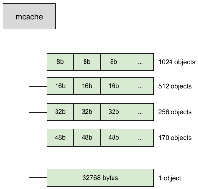
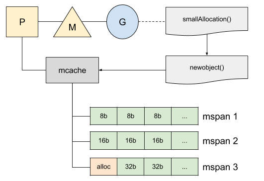
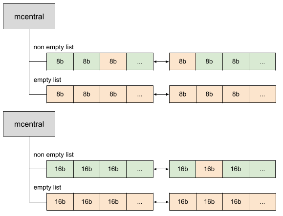
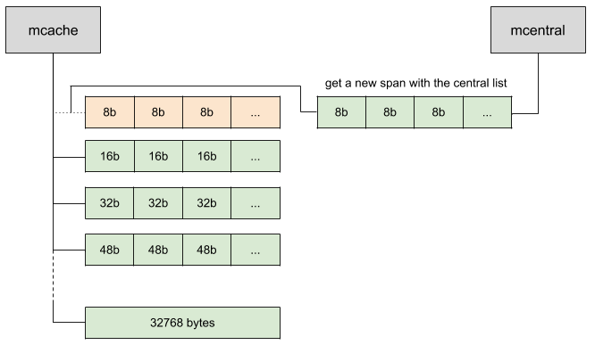
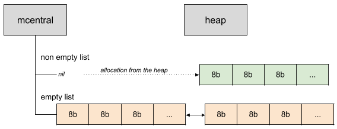
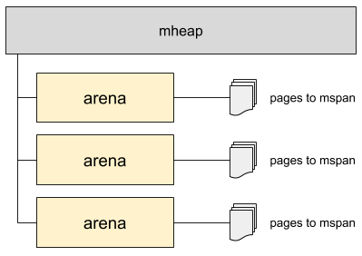
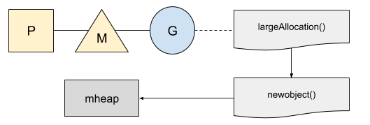
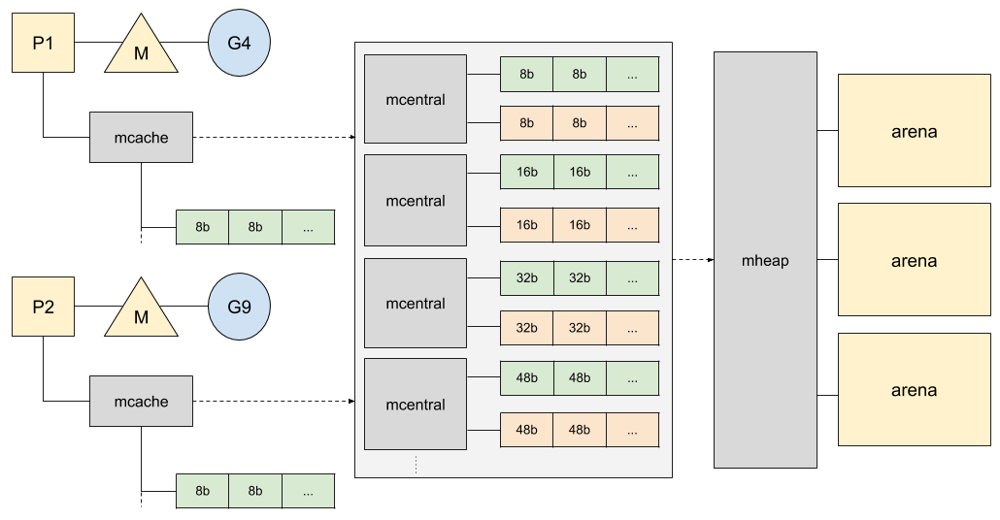

阅读原文：[https://medium.com/a-journey-with-go/go-memory-management-and-allocation-a7396d430f44](https://medium.com/a-journey-with-go/go-memory-management-and-allocation-a7396d430f44)

本文基于 Go 1.13。

当分配的内存不再被使用时，Go 的标准库会自动进行内存管理。尽管开发人员不再需要手动的管理内存，但并不意味着我们不需要理解 Go 的内存管理机制。Go 在底层帮我们做了很多优化，很多机制十分有趣，值得我们花时间去了解下。

## 堆内存的分配

内存管理器需要处理好高并发的场景，并能够跟垃圾回收器很好地协同工作。让我们从一个简单的例子开始看：

```Go
package main

type smallStruct struct {
   a, b int64
   c, d float64
}

func main() {
   smallAllocation()
}

//go:noinline
func smallAllocation() *smallStruct {
   return &smallStruct{}
}
```

代码中有一行注释 **go:noinline** 是用来告诉编译器不要内联的。正常情况下，编译器会直接把调用 smallAllocation 的地方变成函数主体，而不是通过函数调用的方式执行。编译器这样优化是为了减少函数调用的开销，但这样最终不会有任何空间分配，没办法达到我们实验的目的，所以这里加了这个注释。

在命令行中执行 **go tool compile "-m" main.go**** **来对 Go 分配的内存进行逃逸分析：

```
main.go:14:9: &smallStruct literal escapes to heap
```

我们可以用 **go tool compile -S main.go** 转储这个程序的汇编代码，也能够看到内存分配的情况：

```
0x001d 00029 (main.go:14)   LEAQ   type."".smallStruct(SB), AX
0x0024 00036 (main.go:14)  PCDATA $0, $0
0x0024 00036 (main.go:14)  MOVQ   AX, (SP)
0x0028 00040 (main.go:14)  CALL   runtime.newobject(SB)
```

newobject 是用来申请内存和代理 mallocgc 的一个内置函数，mallocgc 是一个管理堆内存的函数。Go 中有两种策略：一种是针对小额内存申请，另一种针对大额内存申请。

## 小额内存申请

对于小于 32KB 的内存申请，Go 将尝试从一个叫 mcache 的本地缓存中获取内存空间。这个缓存维护着一堆 span(32KB 的内存块) 列表，称为 mspan，它包含可用于分配的内存。


每个线程 M 会分配给一个处理器 P，并且每次最多处理一个 goroutine。在分配内存时，当前的 goroutine 会使用当前 p 的本地缓存来查找 span 列表中第一个可用的空闲对象。使用本地缓存不需要加锁，并且可以使分配更有效。

span 列表被划分成 67 个大小种类，从 0 B 到 32 KB，可以存储不同的对象大小：



（补充：可以查看 runtime 下的 sizeclasses.go 文件，其中定义了对 span 大小的划分）

每个 span 存在两次：一个是不包含指针的对象列表，另一个是包含指针的对象列表。这种区分使垃圾回收器的工作更加轻松，因为这样它就不必扫描不包含任何指针的 span 了。

在前面的例子中，结构体的大小是 32 字节，可以放入大小为 32 字节的 span 中：



现在我们可能想知道，如果在内存分配期间，没有足够的空间会发生什么？Go 为每种大小的 span 都维护了一个控制列表，叫做 mcentral。每个 mcentral 会维护两个列表：空闲 span 列表和非空闲列表。



mcentral 把 span 维护在一个双向链表中。每个 span 都有对上一个和下一个 span 的引用。一个在非空链表中的 span （意味着至少有一个空闲的插槽可以被分配）可能已经包含了一些正在使用的内存。实际上，当垃圾回收器清理内存时，它可以清理掉标记为不再使用的部分，并将其放回非空列表中。同样的，不包含可分配内存的 span 放在 empty 链表中，而一个 span 被填满之后，也会从 non-empty 移入到 empty 中。

我们的程序可以在插槽使用完时，想 mcentral 申请一个 span：



当 mcentral 中没有可供分配的 span 时，就需要堆中申请新的 span 到 mcentral 中。



而堆会在需要时，从操作系统申请内存。如果需要特别多的内存，堆将会分配一块儿特别大的内存，称为 arena，这个大小在 64 位架构中是 64 MB，在其他架构中是 4MB。arena 也会将内存页映射为 span：



## 大额内存申请

Go 不适用本地缓存分配大额内存申请。这些大于 32 KB 的申请将被舍入到内存页的大小并直接分配给堆。



## 全局视角

现在我们可以站在更高的角度看内存分配的全貌了，我们把所有组件组合到一起，得到了下图：



## 灵感

内存分配器最初是基于 TCMalloc 实现的，这是一个由 Google 创建的针对并发环境做了专门优化的内存分配器。[TCMalloc 的文档](http://goog-perftools.sourceforge.net/doc/tcmalloc.html)值得一读，你会看到我们前面解释过的概念。    
