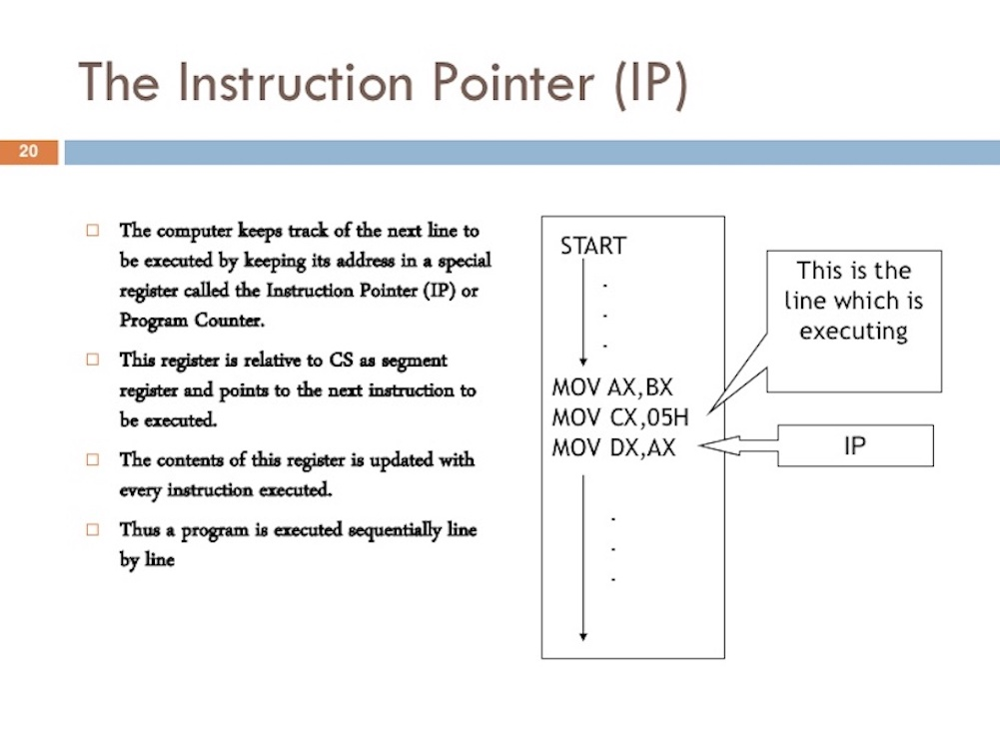

原文地址：[https://www.ardanlabs.com/blog/2018/08/scheduling-in-go-part1.html](https://www.ardanlabs.com/blog/2018/08/scheduling-in-go-part1.html)

# 简介

Go 调度程序的设计使我们的多线程 Go 程序更有效率和性能。 这要归功于 Go 调度程序通过操作系统(OS)调度程序与底层硬件的良好协作（[mechanical sympathies](https://mechanical-sympathy.blogspot.com/)）。 然而，如果你的多线程 Go 程序的设计和行为与调度程序的工作方式无法协调一致，那么 Go 调度程序再怎么优化也是毫无意义的。 对操作系统和 Go 调度程序如何工作有一个全面的了解，能够帮助你正确的设计多线程程序。

本系列文章会划分多个部分重点讨论调度器的底层机制。 我将提供足够的细节，让你能够了解到他们是如何工作的，以便你可以作出更好的工程决策。 尽管在开发一个多线程程序时需要考虑很多方面，但是调度器的机制和语义是我们必须要了解的。

# OS scheduler

操作系统调度器是一个复杂的程序。这个程序依赖于硬件环境的配置，包括但不限于多核 CPU，CPU 缓存和 [NUMA](https://frankdenneman.nl/2016/07/06/introduction-2016-numa-deep-dive-series/)。如果不了解这些，调度器就没办法高效的运转。不过即使我们不去深入研究这些主题，依然能通过了解系统调度器是如何工作的来建立一个良好的思维模型。

我们的程序实际上只是一系列的机器指令，这些指令会被机器一个接一个地执行。为了实现这一点，操作系统使用了「线程」的概念。线程的工作就是按顺序执行分配给它的指令集，直到没有指令可供执行。这就是我为什么把线程称为 —— 执行路径。

你运行的每个程序都会创建一个进程，每个进程都有一个初试线程。线程可以创建更多的线程。这些不同的线程之间彼此独立运行，并且调度决策是在线程级别制定的，而不是在进程级别。线程可以并发运行（每个线程轮流使用一块儿单独的 CPU 核芯，可以理解成一个人在一段时间内处理多个事情），也可以并行运行（每个线程同时运行在不同的 CPU 核芯上，可以理解成多个人在同一时间处理多个事情）。为了安全、局部并且独立的执行这些指令，线程还需要维护好自己的状态。

只要有线程可以执行，操作系统调度程序就会确保 CPU 核芯不会处于空闲状态。它还必须创造一种所有可执行的线程都在同时执行的错觉。在创建这个错觉的过程中，调度程序需要区分不同优先级来运行线程。然而，即使是低优先级的线程也要保证足够的执行时间，不能让它饿死。调度器还需要尽可能快的做出明确的决策来降低调度带来的延迟。

为了实现这个目标，我们花费了很多心思在算法上，幸运的是，经过这个行业几十年的发展，我们得到了很多有价值的经验。为了更好的理解这些，最好定义和描述一些重要的概念。

# 执行指令

[程序计数器（PC）](https://zh.wikipedia.org/wiki/%E7%A8%8B%E5%BC%8F%E8%A8%88%E6%95%B8%E5%99%A8)，有时也称为指令指针（IP），它为线程指定下一条要执行的指令的位置。在大部分处理器中，PC 指向下一条指令而不是当前指令。



图1 [https://www.slideshare.net/johncutajar/assembly-language-8086-intermediate](https://www.slideshare.net/johncutajar/assembly-language-8086-intermediate)

如果你之前看到过 Go 程序的堆栈，那你可能注意到过每行末尾都有小的十六进制数字。例如下面示例堆栈中的 +0x39 和 +0x72。

```Golang
    goroutine 1 [running]:
       main.example(0xc000042748, 0x2, 0x4, 0x106abae, 0x5, 0xa)
           stack_trace/example1/example1.go:13 +0x39                 <- LOOK HERE
       main.main()
           stack_trace/example1/example1.go:8 +0x72                  <- LOOK HERE
```

这些数字表示该函数顶部到该 PC 位置的偏移量。+0x39 PC 偏移量值表示如果程序没有 panic 的话，线程将要执行 example 函数中的下一条指令的位置。+0x72 PC 偏移量值表示如果 example 正常执行完返回到 main 函数后，main 函数要执行的下一条指令位置。更重要的是，这个 PC 偏移量之前的内容告诉你正在执行什么指令。

请看下面这段程序，就是它产生了上面那段堆栈：

```Golang
    // https://github.com/ardanlabs/gotraining/blob/master/topics/go/profiling/stack_trace/example1/example1.go
    
    func main() {
    	example(make([]string, 2, 4), "hello", 10)
    }
    
    func example(slice []string, str string, i int) {
    	panic("Want stack trace")
    }
```

+0x39 表示 example 函数内部指令的 PC 偏移量，该指令在该函数的起始指令的 57 字节（十进制）之后。在下面的输出中，你可以从二进制中找到 example 函数的 objdump。找到第十二条指令，请注意上面的代码行，该指令是对 panic 函数的调用。

```text
    $ go tool objdump -S -s "main.example" ./example1
    TEXT main.example(SB) stack_trace/example1/example1.go
    func example(slice []string, str string, i int) {
      0x104dfa0		65488b0c2530000000	MOVQ GS:0x30, CX
      0x104dfa9		483b6110		CMPQ 0x10(CX), SP
      0x104dfad		762c			JBE 0x104dfdb
      0x104dfaf		4883ec18		SUBQ $0x18, SP
      0x104dfb3		48896c2410		MOVQ BP, 0x10(SP)
      0x104dfb8		488d6c2410		LEAQ 0x10(SP), BP
    	panic("Want stack trace")
      0x104dfbd		488d059ca20000	LEAQ runtime.types+41504(SB), AX
      0x104dfc4		48890424		MOVQ AX, 0(SP)
      0x104dfc8		488d05a1870200	LEAQ main.statictmp_0(SB), AX
      0x104dfcf		4889442408		MOVQ AX, 0x8(SP)
      0x104dfd4		e8c735fdff		CALL runtime.gopanic(SB)
      0x104dfd9		0f0b			UD2              <--- LOOK HERE PC(+0x39)
```

请记住：PC 是下一条指令，而不是当前指令。上面是 Go 程序的线程按照顺序执行基于 amd64 的指令的一个好例子。

# 线程状态

另一个重要概念是线程状态，它描述了调度程序在线程中所扮演的角色。线程可以处于以下三种状态之一：等待、可运行（就绪）和执行。

**等待**：这意味着线程停止运行并等待一些继续执行所需的资源。这可能是在等待硬件（磁盘、网络），操作系统（系统调用）或者同步调用（原子操作、互斥锁）。这些延迟是导致性能糟糕的根本原因。

**就绪**：这意味着线程在等待 CPU 分配给它运行时间，这样他才能执行分配给它的机器指令。如果你有很多线程需要 CPU 时间，那么线程需要等待的时间也会更长。此外，随着更多的线程来争夺 CPU 时间，分配给每个线程的单次执行时间量也会缩短。这种类型的调度延迟也会导致糟糕性能。

**执行**：这意味着线程已经拿到了 CPU 分配的时间，并且正在占用该 CPU 执行机器指令。与应用程序相关的工作正在执行中，这是我们想要的结果。

# 工作类型

线程的工作可以分为两类：一种被称为 CPU 绑定，另一种被称为 IO 绑定。

**CPU 绑定**：这种类型的工作永远不会处于等待状态。这种工作在不断地记性计算，比如计算 Pi 值的第 n 位。

**IO 绑定**：这种工作会让线程进入等待状态。这种工作包括通过网络请求访问资源或者对操作系统进行系统调用等。线程访问数据库就是一种 IO 绑定。我将同步事件（原子操作、互斥锁）也算到这个类别里。

# 上下文切换

如果你的程序跑在 Linux、Mac 或者 Windows 上，这些操作系统都自带了抢占式调度程序。这里隐含了一些重要的事情：首先，这意味着在任何给定时间调度到哪个线程是不可预测的。线程优先级与各种事件（比如从网络中接受数据）让调度程序何时选择运行哪个线程变的无法确定。

其次，这意味着你绝不能根据某些侥幸的经验来写代码。最好能仔细想想，因为我已经看到同样的问题至少发生了 1000 次。如果你需要保证执行顺序的确定性，则必须控制线程的同步和编排。

在 CPU 内核上完成的线程交换的物理行为称为上下文切换。调度程序从 CPU 内核上把一个正在执行的线程拉出，并替换成另一个就绪状态的线程，这个过程就是上下文切换。从就绪队列中选择一个线程变更为执行状态。被拉回的线程可以返回到就绪状态（如果它仍然具备运行的条件），也可以进入等待状态（如果是由于 IO 绑定类型的工作而被替换）。

上下文切换通常认为是一个昂贵的操作，因为他需要花费时间在 CPU 核芯上切换线程。上下文切换过程需要消耗的时间与很多因素有关，但如果要花费 [1000 到 1500 纳秒](https://eli.thegreenplace.net/2018/measuring-context-switching-and-memory-overheads-for-linux-threads/)，就非常不合理。考虑到硬件应该能够合理地（平均）[每核每纳秒执行 12 条指令](https://www.youtube.com/watch?v=jEG4Qyo_4Bc&feature=youtu.be&t=266)，那上下文切换就可能会花费大约 12k 至 18k 的延迟指令。实际上，上下文切换的这段时间，足够让你的程序做很多事情。

如果你的程序专注于 IO 相关的工作，那上下文切换还是有一定优势的。一旦一个线程进入等待状态，另一个处于就绪状态的线程就能立即替代它。这使得 CPU 核芯总是处于工作状态。这是调度中最重要的方面之一。如果有工作要完成（处于就绪状态的线程），不要让 CPU 处于空闲状态。

如果你的程序专注于 CPU 相关的工作，那上下文切换就是一场性能噩梦。由于线程总是有工作要做，上下文切换阻止了工作的进展。这与 IO 绑定的工作所处的情况形成了鲜明的对比。

# 少即是多

早些时候，处理器只有一个核芯，调度过程并不复杂。因为只有一个单核处理器，所以在任何给定时间只会有一个线程处于执行状态。最初的设计是定义一个[调度周期](https://lwn.net/Articles/404993/)，并以一定周期执行这段时间内所有可运行的线程。这当然没问题：将调度周期除以就绪状态的线程数。

举个例子，如果你将调度周期定义为 10ms，并且此时又 2 个线程处于就绪状态，那么每个线程将得到 5ms 的执行时间（每周期）。如果你有 5 个线程，每个线程就获得 2ms 的执行时间。那当你有 100 个线程时又会发生什么呢？给每个线程分配 10μs 的时间片毫无意义，因为你将花费大量的时间在上下文切换上。

你需要限制的是时间片的长度。在最后一个场景中，如果最小时间片为 2ms，并且有 100 个就绪状态线程，则调度周期就需要增加到 2s。如果有 1000 个线程，你就需要一个以 20s 为周期的调度。在这个简单的例子中，如果每个线程使用它分配到的全部时间片，那么所有线程运行一次就需要 20s。

要知道这是一个非常简单的世界观。在进行[调度决策](https://blog.acolyer.org/2016/04/26/the-linux-scheduler-a-decade-of-wasted-cores/)时，还有很多事情需要考虑和处理。你可以控制你自己的程序使用的线程数量。当有更多的线程需要考虑并且发生于 IO 有关的工作时，就会出现更多的不确定性行为。可能需要更长的时间来调度和执行。

这就是为什么游戏规则是“少即是多”。处于就绪状态的线程越少，调度的开销就越少，每个线程分配到的时间片就越多。处于就绪状态的线程越多，意味着每个线程分配到的时间片越少。你的待处理工作量也会随着时间的推移而减少。

# 找到平衡点

你需要在 CPU 核心数和使你的程序达到最佳吞吐量所需的线程数之间找到平衡。当涉及到管理这种平衡时，线程池是一个不错的解决方案。我将在第二部分中向你们展示 Go 不再需要这样做。我认为Go 为多线程应用程序的开发提供了一种更为简单的方式。

在编写 Go 程序之前，我主要用 C++ 和 C# 在 NT 平台编写代码。在该操作系统中，使用 IOCP（IO Completion Ports）线程池是编写多线程程序不可或缺的部分。作为一名工程师，你需要计算出你需要多少线程池，以及需要给每个线程池设定多大的最大线程数量，以充分利用 CPU 核芯数量来提高吞吐量。

在编写与数据库通信的 web 服务时，每个核芯 3 个线程似乎总是能够使 NT 达到最佳吞吐量。换句话说，每个核芯 3 个线程，是上下文切换带来的延迟和核芯上的执行时间的最佳平衡。在创建一个 IOCP 线程池时，我知道我的主机上的每个核芯都至少需要有 1 个线程，最多有 3 个线程。

如果每个核芯分配 2 个线程，那么完成所有的工作所需的时间会更久，因为这中间有空闲时间。如果每个核芯分配 4 个线程，那么花费的时间也许同样会变久，因为更多的上下文切换带来了更多的延迟。每个核芯 3 个线程，是一个最佳平衡，不管是处于什么场景，这个神奇数字在 NT 中总是有效。

如果你的服务在做很多不同类型的工作怎么办？这可能会造成不一致的延迟。也许它还会创建许多需要处理的不同系统层级的事件。可能无法找到一个总是适用于所有不同工作场景的神奇数字。当针对线程池来调优服务性能时，要找到一个合适的配置总是很复杂的。

# Cache Line

从主存中访问数据具有很高的延迟开销（大约 100~300 个时钟周期），因此处理器和核芯都有本地缓存，以使数据保持在需要它的硬件线程附近。从缓存访问数据的成本要低得多（约 3 ~ 40 个时钟周期），具体取决于要访问的缓存。如何有效的将数据放入处理器来减少访问这些数据带来的延迟，也成了现在优化性能的一个方向。编写多状态的多线程程序需要考虑缓存系统的机制。


数据在处理器和内存之间使用 [cache lines](https://www.youtube.com/watch?v=WDIkqP4JbkE) 进行交换。cache line 是一个 64 字节的内存块，可以在内存和缓存系统之间交换。每个核心都会获得所需的任何 cache line 的副本，这意味着硬件使用[值语义](https://www.ardanlabs.com/blog/2017/06/design-philosophy-on-data-and-semantics.html)。这就是为什么多线程程序中的内存突变会引起性能噩梦的原因。

当多个并行的线程访问相同的数据值，甚至是相邻的数据值时，他们将访问相同 cache line 上的数据。在任何内核上运行的任何线程都将获得该 cache line 的副本。


如果某个线程需要在给定核芯上对其 cache line 的副本进行修改，那么通过硬件的魔力，同一 cache line 的所有其他副本都会被标记成 dirty。当另一个线程尝试读或者写这块儿 dirty cache line，会重新从内存获取（100 ~ 300 个时钟周期）一个新的 cache line 副本。

也许在两核处理器上没什么大问题，但是如果一个 32 核处理器并行运行 32 个线程，并且并行的访问和修改同一块 cache line 上的数据呢？如果一个系统又两个物理处理器，每个处理器有 16 个核芯呢？由于处理器与处理器之间的通信，导致了延迟的增加，让情况变得不容乐观。应用程序在内存中找来找去，性能将变得非常糟糕，而且你很可能不知道问题出在哪里。

这就是所谓的[缓存一致性问题](https://www.youtube.com/watch?v=WDIkqP4JbkE&feature=youtu.be)，同时也包括了虚假分享（false sharing）等问题。在编写需要变更共享状态的多线程程序时，必须要考虑到缓存系统。

# 调度决策方案

假设我要求你根据我给出的这些高级信息编写操作系统调度程序。想一想哪种情况是必须要考虑的？注意，这是调度程序在做出调度决策时必须要考虑的许多有趣的事情之一。

你启动你的应用程序，然后创建主线程并在 core 1 上执行。当线程开始执行其指令，由于需要数据，cache lines 将会被读取。现在，主线程决定开启一个新的线程来并发处理一些事情。问题来了。

一旦线程被创建并准备启动，调度程序应该：

1. 在 core 1 上做上下文切换替换掉主线程？这样做可以提高性能，因为新的线程所需的数据大概率已经在缓存中了。但是对主线程来讲，它没有用完自己的全部时间片就被中断了。
2. 在主线程用完时间片之前，新的线程一直处于就绪状态？虽然新线程没有运行，但是一旦启动，就可以用之前的缓存，从而没有不必要的获取数据的延迟。
3. 新线程等待下一个可用的核芯？这意味着所需的 cache lines 将会被重新刷新，查找和复制，从而产生延迟。另一方面，新线程能够更快的得到启动，而同时也能保证主线程的时间片。

有趣不？这些都是操作系统调度器在做出调度决策时需要考虑的问题。我们是幸运的，我们不需要制作这么复杂的程序。我能告诉你的是，任何一个闲置的核芯，都会被使用。当你希望线程运行时，他就在运行。

# 总结

本文的第一部分提供了在编写多线程程序时，你需要考虑哪些线程和操作系统调度相关的问题。这些也是 Go 调度程序需要关注的问题。在下一篇文章中，我将详细讲述 Go 调度器的相关名词以及他们如何与今天讲的这些相关联。最后，运行几个程序你就能看到今天讲的这些行为。
