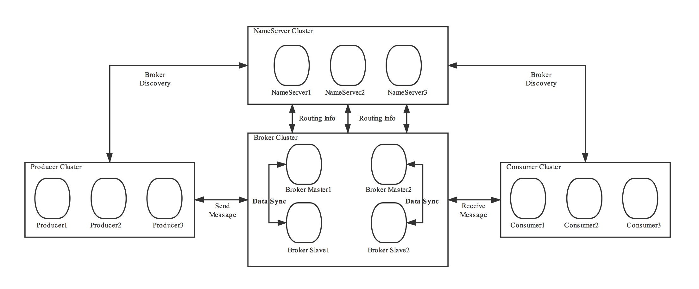

在 RocketMQ 中，client 是通过 NameServer 找到对应的 Broker 的。

NameServer 与 Broker 通信来更新 NameServer 中记录 Broker 信息，包括 topic、queue 的对应关系，topic、Broker 的对应关系，Broker 的物理地址，Broker 的存活情况等等。Broker 内部发生了变更，会及时通知给 NameServer，同时为了保证信息的一致和正确，还会做定时同步。

而对 client 来讲，他会直接从 NameServer 中找到自己想要的信息，并根据自己的需求，找到对应的 Broker。 当 client 访问不到对应的 Broker 时，会重新去 NameServer 拉取信息。

NameServer 之间互相独立，不会同步信息，每一个实例都单独提供服务。

