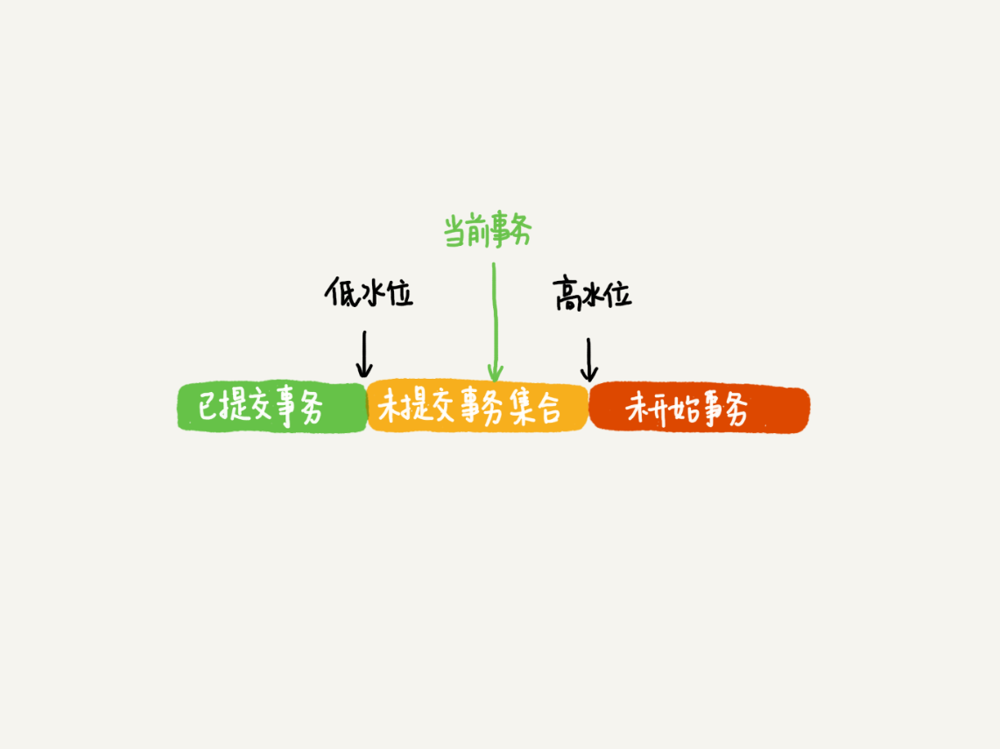

## 1.事务的概念是什么？
事务就是要保证一组数据库操作，要么全部成功，要么全部失败

## 2.事务隔离级别有哪些？各是什么意思？
SQL 标准的事务隔离级别：
* 读未提交 - read uncommitted - 一个事务还没有提交，其修改内容就可以被别的事务读到
* 读提交 - read committed - 一个事务只有提交之后，他的修改内容才能被其他事务看到
* 可重复读 - repeatable read - 一个事务中看到的数据是在事务开始时做的快照
* 串行化 - serializable - 对于同一行记录，写会加写锁，读会加读锁，当多个事务访问时，后访问的事务要等前面的事务提交之后，才能继续访问

## 3.MySQL 中读已提交和可重复读是如何实现的？
先明确一下读提交和可重复读是有区别的：
* 读提交，是在一个事务中，同一个查询可能会有不同的结果，因为别的事务在修改，只要别的事务提交了，在当前事务中总是能拿到最新的值
* 可重复读，是在一个事务中，一开始读到是什么值，在事务提交之前，读到的都是这个值

针对读提交和可重复读，MySQL 是用一致性视图来实现的：
* 读提交，是在每个 sql 语句开始执行时创建视图
* 可重复读，是在事务一开始时的第一条 sql 执行时创建视图，整个事务存在期间，都在用这个视图

另外，读未提交和串行化不需要使用视图。读未提交，每次读拿到的都是最新值，不需要视图。串行化是通过加锁来实现的，也不需要视图

## 4.举例说明可重复读的使用场景
比如我们正在核对用户的支付记录和发货记录，如果这时恰好用户又进行了一次付费购买的操作，不应该影响到核对的事务，此时我们可以使用可重复读的机制：
* 如果核对在用户新的购买之前开始，就要保证核对的事务始终读到的都是新购买产生之前的数据
* 如果核对是在用户新的购买完成之后开始的，我们也能够从最新的数据开始核对

## 5.什么是多版本并发控制？是如何实现的？
顾名思义，多版本并发控制 (MVCC) 就是在并发场景下允许多个版本并存来解决并发问题。上面提到的一致性视图，就是通过 MVCC 实现的。

了解了什么是 MVCC，我们一起来看下 MySQL 中是如何实现 MVCC 的。

#### 事务的起点
begin/start transaction 命令并不是事务的起点，在他们执行后遇到的第一个操作 InnoDB 的语句才是事务的起点。
如何马上启动一个事务？

```SQL
start transaction with consistent snapshot
```

MySQL 中有两个视图的概念：
1. view，是一个用查询语句定义的虚拟表
2. InnoDB 中的 MVCC 一致性视图 —— consistent read view，用于支持 read-commit 和 repeatable read 隔离级别的实现

#### 快照在 MVCC 中是怎么工作的？
InnoDB 中每个事务都有一个唯一的事务 id，它是在事务开始的时候向 InnoDB 事务系统申请的，是按照申请顺序严格递增的。

在 MVCC 中，每行数据可能有多个版本，每次事务更新数据时，都会产生一个新的版本，并且把 transaction id 赋值给这个数据版本的事务 ID，多个事务同时更新一行数据时，这行数据就会对应不同的版本。

更新的时候，以最新的版本为基础进行更新，读的时候，以当前事务 ID 对应的版本去读。

所谓快照，并不是真实的创建一个同等大小的镜像数据。MySQL 会把数据的变更行为，记录到 **undo log** 中，需要去读旧的数据的时候，就拿最新的数据，结合 undo log 回溯到当前事务 ID 对应的数据版本。

#### 具体的讲可重复读是如何实现的呢？
在事务启动时，会根据事务启动的时间来看当前的最新数据，该时间之前的最新数据就是他能读到的数据，该时间之后的数据，他不会认。


(图片来自 [https://time.geekbang.org/column/article/70562](https://time.geekbang.org/column/article/70562))

InnoDB 为每个事务分配了一个事务 ID，每一行数据，都可能会有多个版本，每个版本与一个事务 ID 对应。InnoDB 会把所有行数据的更新操作记录到 undo log 中，undo log 中还会记录对应版本的事务 ID，处于某个事务的查询在读取该行数据时，会从 undo log 中找到对应的版本，进行回退计算，得出事务开始时建立的快照的数据。

在具体实现上，InnoDB 会为每个事务构造一个数组，用来保存在该事务启动时，当前正在活跃的所有事务 ID，活跃就是指启动了但还没提交。数组中，ID 的最小值叫做低水位，ID 的最大值 + 1 表示为高水位。

得到一致性视图的方式就变成了对几种情况的判断：
1. 该行数据对应的最新版本的事务 ID 落在低水位之前，表示这个版本已经被提交，或者是该事务自己修改的，数据可见
2. 如果落在高水位之后，这个数据是由将来启动的事务产生的，一定对当前事务不可见
3. 如果落在低水位和高水位之间，并且最新版本的事务 ID 不在活跃事务数组中，说明在当前事务启动之前，修改该行数据的那个事务就已经完成了，因此数据可见。
4. 如果落在低水位和高水位之间，并且最新版本的事务 ID 在活跃事务数组中，说明当前事务启动时，更新该行数据的事务还没有提交，因此数据不可见。

可重复读的核心：
当事务更新数据时，只能用当前读，如果当前行的记录被其他事务锁定，就需要进入锁等待。

# Reference
https://time.geekbang.org/column/article/70562
这个专栏很不错，值得订阅！


