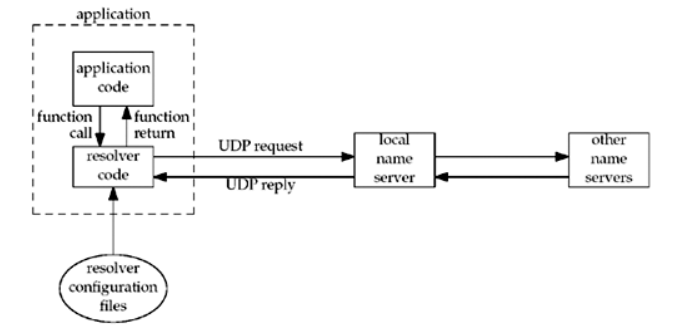

应用程序通过调用 glibc(GNU c库，linux 操作系统的一个重要组成部分) 中提供的 getaddrinfo、getnameinfo 等函数来获取域名对应的真实地址。

而 getaddrinfo 这些函数，会调用解析器(图中的 resolver code)，解析器则读取配置文件来获取系统对 DNS 的相关配置，这些配置文件包括：/etc/hosts，/etc/resolv.conf 等。这些配置文件中会控制选择什么域名解析服务，超时时间、重试次数、优先级等。

我随便找了台服务器看下 /etc/resolv.conf：

```text
    nameserver 100.100.2.136
    nameserver 100.100.2.138
    options timeout:2 attempts:3 rotate single-request-reopen
```

从这个配置里可以看到，我们有两个域名解析服务 100.100.2.136 和 100.100.2.138，解析器会按顺序先到 100.100.2.136 上找待查找的域名，找不到才会去 100.100.2.138 上找。这里还设置了超时时间为 2，如果失败，会在每个服务器上重试 3 次。这里还设置了 rotate，表示解析器会随机选一个 DNS 服务器作为首选。

single-request-reopen 是为了做 DNS 优化：当 A 域名的解析请求和 AAAA 域名的解析请求从同一个端口发出时，如果某个域名先响应回来，会导致某些防火墙直接将端口关闭，从而使另一个域名解析请求一直等待直到超时。加上这个参数之后，一旦发生这种情况，不会等待超时而是直接新建一个端口重新发起请求。

在 Golang 中的 net 包依赖了域名解析操作。在 Go 中，有两种方式进行域名解析：

- Go 原生定义的解析器，直接用一个 goroutine 解析 resolv.conf
- 通过 cgo 调用 glibc 中的 getaddrinfo 和 getnameinfo 等方法

这两者存在的区别在于开销不同，使用 go 自定的解析器只需要占用一个 goroutine 即可，而调用 glibc 的方式则需要占用一个操作系统线程。

参考资料：

- [https://blog.arstercz.com/linux-系统如何处理名称解析/](https://blog.arstercz.com/linux-%E7%B3%BB%E7%BB%9F%E5%A6%82%E4%BD%95%E5%A4%84%E7%90%86%E5%90%8D%E7%A7%B0%E8%A7%A3%E6%9E%90/)
- [http://man7.org/linux/man-pages/man5/resolv.conf.5.html](http://man7.org/linux/man-pages/man5/resolv.conf.5.html)
- [https://golang.org/pkg/net/](https://golang.org/pkg/net/)
